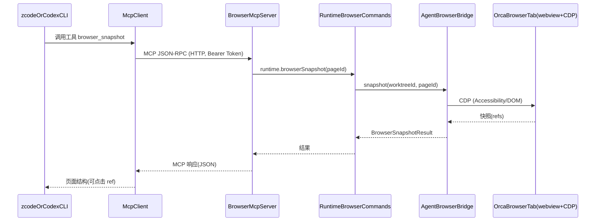

# orca 浏览器自动化 MCP Server 设计方案

> 日期：2026-08-26
> 状态：设计稿（待评审）
> 关联记忆：orca 二开工程 · 浏览器自动化增强

## 1. 背景与目标

用户在使用 orca 时，常在一个 worktree 下同时开两个标签页：

- 一个 **终端标签页** 跑自定义 agent CLI（zcode / codex 之类）；
- 一个 **浏览器标签页** 打开待测/已上线的网站。

诉求：让终端里的 CLI agent 能够**直接驱动那个浏览器标签页**——读取页面内容、点击元素、填写表单、输入文字、导航跳转，类似浏览器自动化测试，用于「边看源码边看网站、自动产出文档」等场景。

一句话目标：**把 orca 已有的浏览器自动化能力，通过一个标准 MCP Server 暴露给外部 agent CLI。**

## 2. 现状核查（关键结论：核心能力已现成）

经代码核查，orca 内部「驱动浏览器标签页」的全套能力**已经完整存在**，只对「orca 内置 agent」开放，外部 CLI 进不来。缺口只有一个：缺少一个「出口」。

| 能力 | 现有实现位置 | 说明 |
|------|--------------|------|
| 浏览器标签页 | Electron `<webview>`（`browser-page-webview.ts`），main 进程持有完整 `webContents` + `debugger` 权限（`createMainWindow.ts` 启用 `webviewTag`，`will-attach-webview` 锁定 `nodeIntegration=false`/`contextIsolation=true`/`sandbox=true`） | 安全隔离到位，main 可直接发 CDP 命令 |
| CDP 桥 | `src/main/browser/cdp-bridge.ts` | snapshot/click/fill/type/select/scroll/screenshot/evaluate/goto/cookie/viewport/console/network 等 |
| agent-browser 桥 | `src/main/browser/agent-browser-bridge.ts` | 调原生 `agent-browser` 二进制（npm ~0.27.0），经 `CdpWsProxy` 连到 webview 的 CDP |
| **统一入口（façade）** | `src/main/runtime/orca-runtime-browser.ts` 的 `RuntimeBrowserCommands` | 已暴露 `browserSnapshot/browserClick/browserGoto/browserFill/browserType/browserSelect/browserScroll/browserScreenshot/browserEval/browserTabList/browserTabShow/browserTabCurrent/browserHover/browserDrag/browserUpload/browserWait/browserCheck/browserFocus/browserClear/browserKeypress/browserPdf/browserCookieGet/Set/Delete/browserSetViewport/...` 等 **40+ 方法**，全部支持 `worktree` + `page` 定位 |
| MCP 设施 | `src/shared/mcp-config.ts`、`mcp-server-inspection.ts` | orca 目前**作为 MCP 客户端**读取外部 MCP 配置；本身不 host MCP Server（需新增） |
| MCP SDK | `node_modules/@modelcontextprotocol/sdk@1.30.0` | 已提供 `Server`、`StreamableHTTPServerTransport`、`SSEServerTransport`，可直接复用 |

**结论**：要做的只是在 main 进程加一层「MCP Server 适配器」包住 `RuntimeBrowserCommands`，**零重造浏览器逻辑**。

## 3. 方案总览

### 3.1 架构时序（Mermaid，ASCII 参与者别名）



### 3.2 数据流

```
终端标签页(zcode/codex)
   │  MCP 客户端（用户在 CLI 配置里填 URL+Token）
   ▼  HTTP  (127.0.0.1:<port>/mcp, Bearer Token)
BrowserMcpServer  (新增, main 进程)
   │  1:1 映射，纯适配，无浏览器逻辑
   ▼
RuntimeBrowserCommands  (已有 façade, orca-runtime-browser.ts)
   ▼
AgentBrowserBridge / CdpBridge → orca 浏览器标签页(CDP)
```

## 4. 新增模块与职责（main 进程）

新增目录 `src/main/browser/mcp/`，每个文件职责单一（**禁止** 为绕过 `max-lines` 加 disable，必要时继续拆分）：

| 文件 | 职责 |
|------|------|
| `browser-mcp-server.ts` | 构造 MCP `Server`，注册 `tools/list` + `tools/call` 处理器；start/stop 生命周期；从 definitions 装配 |
| `browser-mcp-http-transport.ts` | 在 `127.0.0.1` 起 Node `http` server，挂载 `StreamableHTTPServerTransport`，强制 Bearer Token 鉴权；端口分配与冲突回退 |
| `browser-mcp-tool-definitions.ts` | 工具清单：`{ name, description, inputSchema(JSON Schema), handler }`，每个 handler 调 `RuntimeBrowserCommands` 对应方法 |
| `browser-mcp-settings.ts` | 读写设置项 + token 安全存储（复用 `safeStorage`） |

> 命名遵循「具体域名」原则，不使用 `helpers`/`utils` 等泛化名。

## 5. MCP 工具列表（分两阶段）

所有工具均带可选 `pageId`；缺省时取**当前活动浏览器标签页**（与内置 agent 行为一致）。`browser_tab_list` 用于发现 id。

### 阶段一：只读优先（MVP，先打通「CLI 能看见页面」）

| MCP 工具 | 映射到 `RuntimeBrowserCommands` | 说明 |
|----------|--------------------------------|------|
| `browser_tab_list` | `browserTabList({worktree?})` | 列出全部浏览器标签页 `{worktreeId, pageId, url, title, active}` |
| `browser_tab_current` | `browserTabCurrent({worktree?})` | 当前活动标签页信息 |
| `browser_snapshot` | `browserSnapshot({worktree?, page?})` | 页面无障碍/DOM 快照，含可点击 ref（驱动点击的前提） |
| `browser_screenshot` | `browserScreenshot(...)` / `browserFullScreenshot(...)` | 截图（PNG/JPEG，base64 返回；设大小上限） |
| `browser_evaluate` | `browserEval({worktree?, page?, expression})` | 在页面执行 JS，返回结果 |

### 阶段二：交互能力（MVP 验证后再补）

| MCP 工具 | 映射到 | 说明 |
|----------|--------|------|
| `browser_navigate` | `browserGoto` | 打开 URL |
| `browser_click` | `browserClick` | 按 ref / selector / text 点击 |
| `browser_fill` | `browserFill` | 清空并填表 |
| `browser_type` | `browserType` | 输入文本 |
| `browser_select` | `browserSelect` | 下拉选择 |
| `browser_hover` | `browserHover` | 悬停 |
| `browser_scroll` | `browserScroll` | 滚动 |
| `browser_wait` | `browserWait` | 等待条件 |
| `browser_dblclick` / `browser_drag` / `browser_upload` | 对应方法 | 双击/拖拽/上传 |
| `browser_keypress` / `browser_clear` / `browser_select_all` / `browser_check` / `browser_focus` | 对应方法 | 键盘/清空/全选/勾选/聚焦 |
| `browser_back` / `browser_forward` / `browser_reload` | 对应方法 | 历史导航 |
| `browser_cookie_get/set/delete` | 对应方法 | Cookie 操作（按需） |

> 阶段二每个工具都是 `RuntimeBrowserCommands` 现有方法的 1:1 薄封装，无新浏览器逻辑。

## 6. 传输与安全（用户已拍板：本地 HTTP/SSE）

- **传输**：`StreamableHTTPServerTransport`（MCP 当前标准，单端点 `/mcp`，支持 SSE 流式响应）。SDK v1.30 已含。
- **绑定**：**仅 `127.0.0.1`（loopback）**，绝不 `0.0.0.0` / 公网。
- **鉴权**：启用时生成随机 Bearer Token，用 `safeStorage` 存储；请求头 `Authorization: Bearer <token>`。
- **默认关闭**：设置项 `browserAutomationMcp.enabled` 默认 `false`（opt-in）。
- **端口**：`browserAutomationMcp.port` 默认 `0`（启动时选空闲端口并持久化；占用时回退相邻端口并提示）。
- **大 payload 防护**：截图/网络日志设尺寸与条数上限，避免 MCP 响应膨胀。

### 6.1 用户在 CLI 侧如何接入

Settings 内新增「浏览器自动化」区域，提供「复制 MCP 配置」按钮，输出如下 JSON（用户粘贴进 zcode/codex 的 MCP 配置）：

```json
{
  "mcpServers": {
    "orca-browser": {
      "url": "http://127.0.0.1:<port>/mcp",
      "headers": { "Authorization": "Bearer <token>" }
    }
  }
}
```

## 7. 标签页定位模型

- `browser_tab_list` 返回每个标签页的 `worktreeId` + `pageId` + `url` + `title` + `active`，agent 据此选择目标。
- 其余工具 `pageId` 缺省 → 当前活动标签页（`RuntimeBrowserCommands` 已按 worktree 记录 `activeWebContentsPerWorktree`）。
- 可选后续增强：设置项 `defaultWorktree` 限定作用域（首版不做，保持简单）。

## 8. 实施步骤（分阶段）

- **Phase 0 — 骨架**：设置项 + token 安全存储 + bootstrap（server 可起可停，健康检查返回 200）。
- **Phase 1 — 只读 MCP**：`tab_list`/`tab_current`/`snapshot`/`screenshot`/`evaluate` + Settings UI + 复制配置。验证「CLI 能读页面」。
- **Phase 2 — 交互 MCP**：navigate/click/fill/type/select/hover/scroll/wait/... 工具。
- **Phase 3 — 测试与验证**：单测 + 手动联调 + 文档。

## 9. 复用与风险

### 9.1 复用（低风险根基）

- 浏览器逻辑 100% 复用既有 `cdp-bridge` / `agent-browser-bridge` / `snapshot-engine`，均有现成测试（`agent-browser-bridge-*.test.ts`、`cdp-bridge-integration.test.ts` 等）。
- MCP SDK 已在工程内，无需新增依赖。
- 可用设置开关隔离，不影响默认用户。

### 9.2 已知限制 / 风险

- **SSH/远程场景**：若 orca 跑在远程主机、CLI 在本地，`127.0.0.1` 不可达——属已知限制，可后续经现有远程隧道解决；**本次不改远程 wire 协议**（纯本地 main 进程新增 HTTP server，无 paired client/host wire 变更）。
- **多 orca 实例/端口冲突**：固定端口占用时回退相邻端口或明确报错。
- **跨平台**：端口分配与 http server 在 macOS/Linux/Windows 行为一致，不假设 `/` 路径分隔。
- **安全**：token 视作凭据（safeStorage）；仅 loopback 绑定 + 默认关闭 + Bearer 鉴权三层防护。

## 10. 约束清单（实施时逐条自查）

- 【约束】HTTP server **必须只绑定 127.0.0.1**，禁止 `0.0.0.0`/公网。
- 【约束】**默认关闭**（opt-in），且须 Bearer Token 鉴权；token 用 `safeStorage` 存储。
- 【约束】新增文件**不得**加 `max-lines` disable；每个文件职责单一（server/transport/tool-definitions 拆分）。
- 【约束】文件命名具体，不用 `helpers`/`utils` 等泛化名。
- 【约束】跨平台：端口分配、http server 在 macOS/Linux/Windows 一致；路径用 `path.join`。
- 【约束】**不改变** orca 与配对客户端的远程 wire 协议（纯本地 main 进程新增 HTTP server）。
- 【约束】**复用** `RuntimeBrowserCommands`，不新建浏览器逻辑；MCP 层为纯适配。
- 【约束】i18n：新增 UI 文案需补 `zh` 等语言键（`en.json` 由 sync 自动补，`zh/es/ja/ko` 手工补）。
- 【约束】截图/网络日志等大 payload 须设上限，避免 MCP 响应膨胀。
- 【约束】端口冲突时回退相邻端口或明确报错提示。

## 11. 验证方案

- **单测**：沿用 `agent-browser-bridge-*.test.ts` 风格，对 MCP server 做 tool dispatch 测试（mock `RuntimeBrowserCommands`），校验入参映射与返回结构；transport 鉴权测试（无 token / 错 token → 401）。
- **集成（手动）**：设置→启用→复制 MCP 配置→在 zcode 配置粘贴→开浏览器标签页访问 example.com→让 zcode「截个图 / 点搜索框 / 读页面文本」→ 验证 orca 浏览器标签页被驱动。
- **质量门**：typecheck / oxlint / build 全绿。

## 12. 产物与交付

- 设计文档：`docs/2026-08-26-浏览器自动化MCP服务设计方案.md`（本文件）
- 代码：新增 `src/main/browser/mcp/*` + 设置项 + Settings UI（按 Phase 0→3 提交，每阶段独立验证）
- 日记忆：`.workbuddy/memory/2026-08-26.md`（本设计决策与约束）
